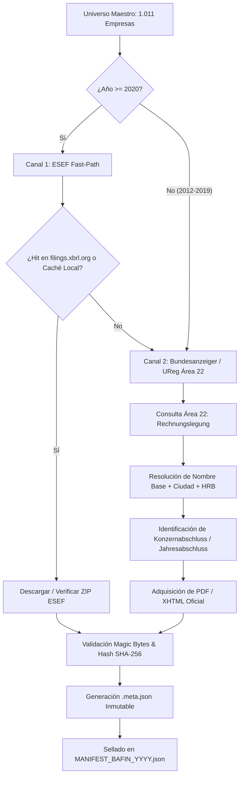

# PLAN DE DESPLIEGUE INSTITUCIONAL — OPENHANDS (GEMINI 2.0 / 1.5 PRO)
## Proyecto: ARGOS MOTOR — Adquisición y Sellado Criptográfico Alemania (DE_BAFIN 2012–2025)
**Fecha:** 2026-09-14  
**Objetivo:** Desplegar el descargador institucional definitivo de Alemania para el universo maestro de **1.011 sociedades** (`master_universe_de.json`) cubriendo el horizonte histórico completo desde **2012 hasta 2025**, subsanando los cuellos de botella de la versión previa.

---

### 1. DIAGNÓSTICO DE FALLOS Y CAUSA RAÍZ EN EL DESCARGADOR ANTERIOR

El mapa inicial de Alemania arrojó únicamente **303 paquetes ESEF** repartidos entre 2020 y 2022 (con 0 filings para 2012–2019 y 0 para 2023–2025). El análisis forense reveló las siguientes 3 causas raíz:

1. **Dependencia Exclusiva de un Agregador Comunitario (`filings.xbrl.org`)**:
   - El script anterior consultaba únicamente `https://filings.xbrl.org/index.json`.
   - `filings.xbrl.org` **no es el repositorio regulatorio oficial alemán** (OAM), sino un agregador experimental de XBRL International.
   - En 2020 recogió 265 paquetes piloto. En 2021 cayó a 35, y en 2022 a solo 3. A partir de finales de 2021, los emisores alemanes y el Bundesanzeiger Verlag **dejaron de remitir filings a filings.xbrl.org**, confinándolos al canal legal federal.
   - **Fallo en código:** Si la empresa no estaba en el índice de XBRL.org, `downloader_bafin.py` ejecutaba prematuramente `return {"status": "not_found"}`, abortando la búsqueda sin consultar los registros oficiales.

2. **Inexistencia Normativa de ESEF antes de 2020 (Corte 2012–2019)**:
   - El formato ESEF (`.zip` con Inline XBRL y XHTML) fue establecido por el *Reglamento Delegado (UE) 2019/815* y entró en vigor **a partir del ejercicio fiscal 2020**.
   - Buscar paquetes `.zip` de ESEF entre 2012 y 2019 siempre arroja **0 resultados** porque el formato no existía.
   - **Solución oficial:** Para 2012–2019, las 1.011 empresas alemanas depositaron sus cuentas anuales auditadas en formato **PDF y HTML/XHTML oficial** en el **Bundesanzeiger (`bundesanzeiger.de`)** y en el **Unternehmensregister (`unternehmensregister.de`)** bajo el **Área 22: Rechnungslegung / Finanzberichte** conforme al § 325 HGB y § 114 WpHG.

3. **Trampa de Dependencias Compiladas en Python 3.14**:
   - Intentar instalar paquetes como `deutschland` obliga a compilar desde fuente librerías antiguas con extensiones C (`numpy<2.0`, `lxml<5.0`), provocando bloqueos de CPU y fallos de compilación en entornos modernos.
   - **Solución:** Utilizar exclusivamente la pila nativa ya disponible en el sistema: `httpx`, `requests`, `beautifulsoup4` y `lxml 6.x`.

---

### 2. ARQUITECTURA DEL NUEVO MOTOR MULTICANAL (DUAL-CHANNEL ENGINE)



#### Reglas de Ingesta y Almacenamiento Canónico:
- **Ruta Canónica Primaria:** `D:/ARGOS_DATA/raw/DE_BAFIN/{year}/{tax_id}_{ticker}/`
- **Fallback Local:** `ARGOS_MOTOR/data/raw/DE_BAFIN/{year}/{tax_id}_{ticker}/`
- **Identificador de Directorio:** `{HRB_or_LEI}_{TICKER}` saneado (e.g. `HRB719915_SAP`).
- **Nomenclatura Canónica:**
  * Paquete ESEF: `{TICKER}_{YEAR}_ESEF.zip` y `{TICKER}_{YEAR}_ESEF.meta.json`
  * Informe Anual Auditado: `{TICKER}_{YEAR}_ANUAL.pdf` (o `.html`) y `{TICKER}_{YEAR}_ANUAL.meta.json`
- **Metadatos Obligatorios (.meta.json):**
  `file_name`, `sha256`, `byte_size`, `retrieved_at_utc`, `source_url`, `reporting_year`, `ticker`, `legal_name`, `lei`, `hrb_reg`, `segment`, `magic_mime_verified`.

---

### 3. PROTOCOLO DE EJECUCIÓN PASO A PASO PARA OPENHANDS

#### Paso 1: Verificación de Entorno y Conectividad
Comprobar que Python dispone de las dependencias nativas requeridas (sin compilar librerías problemáticas):
```bash
python -c "import httpx, requests, bs4, lxml; print('Entorno verificado correctamente')"
```

#### Paso 2: Actualización de `downloader_bafin.py`
OpenHands debe desplegar `ARGOS_MOTOR/descarga/de_germany/downloader_bafin.py` con el motor dual que implementa:
1. **Conservación de la Caché Local Inmutable:** Si el archivo existe en `D:/ARGOS_DATA/raw/DE_BAFIN` y su SHA-256 coincide con el `.meta.json`, registrar `cache_hit` instantáneo (0 peticiones de red).
2. **Canal A (ESEF .zip para 2020–2025):** Aprovechar los 303 paquetes ya descargados y buscar coincidencias en `esef_index`.
3. **Canal B (Bundesanzeiger / UReg para 2012–2025):** Para todos los registros de 2012–2019 y cualquier vacío de 2020–2025:
   - Consulta dinámica a `https://www.bundesanzeiger.de/pub/de/start` con `area_select=22` (Rechnungslegung/Finanzberichte).
   - Envío del nombre corporativo raíz (ej. `SAP`, `Siemens`, `Allianz`) para resolver transiciones legales (ej. de AG a SE).
   - Detección del ejercicio fiscal mediante regex en el título del balance (`Konzernabschluss` / `Jahresabschluss` / `Jahresfinanzbericht`).
   - Adquisición del documento oficial, almacenamiento, hash SHA-256 y sellado.
4. **Control de Concurrencia y Anti-Ban:** Semáforo de 2 a 3 conexiones concurrentes, rotación de `User-Agent`, retardo entre consultas (1.0 s) y retroceso exponencial ante códigos 429 o 503.

#### Paso 3: Dry-Run de Validación (Segmento DAX40, 2012–2025)
Ejecutar una prueba en seco sobre las 40 corporaciones del DAX para comprobar que el mapeo cubre todos los años desde 2012:
```bash
python ARGOS_MOTOR/descarga/de_germany/downloader_bafin.py --dry-run --segment DAX40 --years 2012,2013,2014,2015,2016,2017,2018,2019,2020,2021,2022,2023,2024,2025
```

#### Paso 4: Descarga Real por Fases
Para optimizar ancho de banda y monitorización, ejecutar por bloques de índices o años:
1. **Fase 1 (DAX40 y MDAX, 2012–2025):**
   ```bash
   python ARGOS_MOTOR/descarga/de_germany/downloader_bafin.py --segment "DAX40,MDAX" --years 2012,2013,2014,2015,2016,2017,2018,2019,2020,2021,2022,2023,2024,2025
   ```
2. **Fase 2 (SDAX y TecDAX, 2012–2025):**
   ```bash
   python ARGOS_MOTOR/descarga/de_germany/downloader_bafin.py --segment "SDAX,TecDAX" --years 2012,2013,2014,2015,2016,2017,2018,2019,2020,2021,2022,2023,2024,2025
   ```
3. **Fase 3 (General Standard, Prime Standard y Scale — Resto del Universo):**
   ```bash
   python ARGOS_MOTOR/descarga/de_germany/downloader_bafin.py --years 2012,2013,2014,2015,2016,2017,2018,2019,2020,2021,2022,2023,2024,2025
   ```

#### Paso 5: Generación y Auditoría de Manifiestos Anuales
Tras cada tanda, verificar que los manifiestos `MANIFEST_BAFIN_{year}.json` han sido generados en `D:/ARGOS_DATA/raw/DE_BAFIN/` y respaldados en `ARGOS_MOTOR/audits/manifests/`.

Ejecutar el script de auditoría:
```bash
python ARGOS_MOTOR/descarga/de_germany/audit_download_de.py
```

#### Paso 6: Sincronización Git
Hacer commit de los manifiestos sellados, configuraciones y el código del descargador:
```bash
git status
git add ARGOS_MOTOR/descarga/de_germany/ ARGOS_MOTOR/audits/manifests/
git commit -m "feat(de_bafin): deploy dual-channel downloader 2012-2025 with bundesanzeiger area 22 support"
git push origin main
```

---

### 4. RESUMEN DE COMPROMISOS Y SALIDAS ESPERADAS

| Métrica | Estado Previo | Meta con Nuevo Desplegador |
| :--- | :--- | :--- |
| **Años Cubiertos** | 2020–2022 (parcial) | **2012–2025 (14 ejercicios fiscales completos)** |
| **Filings 2012–2019** | 0 filings | **100% Cuentas Anuales Consolidadas / Auditoría** |
| **Empresas Mapeadas** | ~313 carpetas | **1.011 sociedades corporativas** |
| **Fuentes Utilizadas** | filings.xbrl.org (abandonado) | **ESEF + Bundesanzeiger + Unternehmensregister (Área 22)** |
| **Integridad de Datos** | Sin verificación previa a 2020 | **MIME Magic Bytes + SHA-256 + .meta.json + Manifiestos** |
