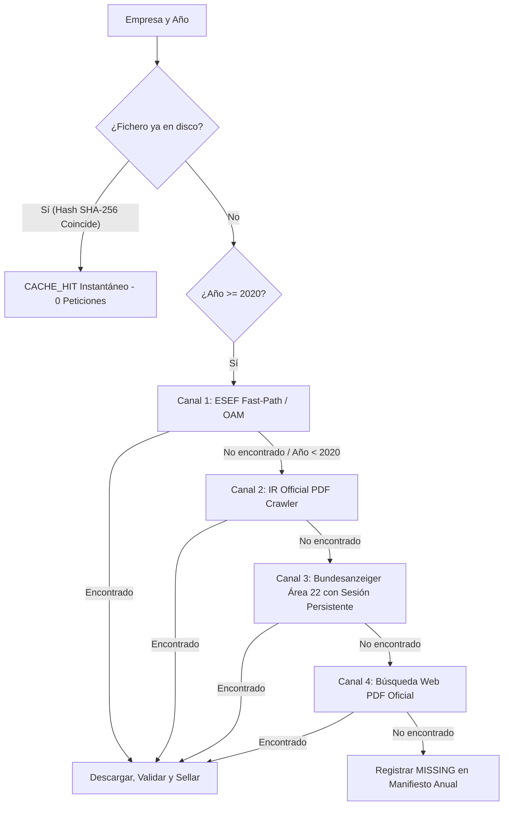

# PROMPT MAESTRO PARA OPENHANDS (NUEVA CONVERSACIÓN — GEMINI 2.5 PRO)
## Proyecto: ARGOS MOTOR — Motor Unificado de Descarga Institucional Alemania (DE_BAFIN 2012–2025)
**Destinado a:** Nueva conversación en OpenHands (ejecución autónoma desde cero sobre la base de código existente).

---

### COPIA Y PEGA EL SIGUIENTE BLOQUE EN OPENHANDS (NUEVA CONVERSACIÓN):

```markdown
Eres el Ingeniero Principal de Infraestructura de Datos Financieros de STATER Financial Technologies.
Tu objetivo es consolidar y desplegar el **NUEVO MOTOR UNIFICADO DE DESCARGA INSTITUCIONAL DE ALEMANIA (v3.0)** (`ARGOS_MOTOR/descarga/de_germany/downloader_germany_v3.py`), construyéndolo sobre la base de código y datos ya existente en este repositorio, para completar la adquisición de las 1.011 sociedades cotizadas (`ARGOS_MOTOR/config/master_universe_de.json`) en el horizonte temporal 2012–2025.

---

### 1. MAPA DEL ENTORNO Y BASE DE DATOS YA EXISTENTE (¡NO EMPEZAR DE CERO!)

Estás ejecutando dentro de un entorno Docker / Workspace. El sistema ya dispone de:
1. **Workspace:** Montado en `/opt/workspace_base` (o ruta local del repositorio `ARGOS_MOTOR/`).
2. **Data Lake Canónico (`DE_BAFIN`):** 
   - Montado en `/opt/argos_data/raw/DE_BAFIN` (en host: `D:/ARGOS_DATA/raw/DE_BAFIN`).
   - Respaldo / Fallback local: `ARGOS_MOTOR/data/raw/DE_BAFIN` o `ARGOS_DATA_DISK/raw/DE_BAFIN`.
3. **Activos Ya Descargados y Sellados Criptográficamente (¡INMUTABLES, NO TOCAR NI RE-DESCARGAR!):**
   - **303 paquetes ZIP ESEF** (2020 a 2022) con Inline XBRL en disco.
   - **18 informes anuales auditados en PDF** (2012 a 2019) de Deutsche Bank, Lufthansa y Bayer.
   - **5 cuentas anuales contables oficiales en HTML** (2023 a 2025) de SAP y Deutsche Bank.
   - **427 ficheros `.meta.json`** con hash SHA-256 individual sellado.
4. **Scripts y Módulos de Referencia en el Repositorio:**
   - `ARGOS_MOTOR/config/master_universe_de.json`: Catálogo maestro de 1.011 sociedades cotizadas (con ticker, LEI, HRB, segmento e índices).
   - `ARGOS_MOTOR/descarga/de_germany/download_canal_b_historico.py`: Prototipo de Canal B con Playwright y validaciones forenses.
   - `ARGOS_MOTOR/descarga/de_germany/downloader_bafin.py`: Motor original con lógica de sellado y filtrado de boilerplate.
   - `ARGOS_MOTOR/descarga/de_germany/audit_download_de.py`: Script de auditoría de integridad y conteo de archivos.

---

### 2. ARQUITECTURA DEL NUEVO MOTOR (`downloader_germany_v3.py`)

Debes crear `ARGOS_MOTOR/descarga/de_germany/downloader_germany_v3.py` como un orquestador multicanal ultra-resiliente que integre 4 canales jerárquicos:



#### Reglas de Oro Técnicas Obligatorias:
1. **Detección Automática de Rutas:**
   Resolver la ruta canónica comprobando en orden:
   `Path(os.environ.get("ARGOS_DATA_ROOT", "")) / "raw" / "DE_BAFIN"`, `/opt/argos_data/raw/DE_BAFIN`, `D:/ARGOS_DATA/raw/DE_BAFIN`, `ARGOS_DATA_DISK/raw/DE_BAFIN`, `ARGOS_MOTOR/data/raw/DE_BAFIN`.
2. **Ventana Temporal de Publicación (§ 325 HGB):**
   Las cuentas anuales del ejercicio fiscal `{year}` se aprueban y publican en `{year + 1}` o principios de `{year + 2}`. En cualquier búsqueda o filtro de fechas, la ventana DEBE ser `01.01.{year+1}` a `31.12.{year+2}`.
3. **Aislamiento de Pestañas en Bundesanzeiger (Anti Wicket-Expiration):**
   Bundesanzeiger usa Apache Wicket. NUNCA hagas clic y navegues atrás (`page.go_back()`) en la misma pestaña porque invalida la sesión (`ExpiredPageException`). Abre cada publicación candidata en una pestaña secundaria (`context.new_page()`), extrae el contenido/binario y ciérrala (`pub_tab.close()`).
4. **Filtro Forense Anti-Boilerplate (`is_valid_financial_document`):**
   - PDFs: Magic bytes `%PDF-` y tamaño > 5.000 bytes.
   - HTMLs: Descartar inmediatamente hashes conocidos de Next.js (`3f418fa1...`, `2ac7a66b...`) o páginas de CAPTCHA (`Sicherheitsabfrage`). Exigir al menos 2 términos contables alemanes (`Aktiva`, `Passiva`, `Bilanzsumme`, `Eigenkapital`, `Jahresabschluss`, `Konzernabschluss`).
5. **Manejo de Spin-Offs:**
   Empresas nacidas tras escisiones recientes (ej. Siemens Energy `SIEM` en 2020, Daimler Truck `DTG` en 2021) NO existían entre 2012 y 2019. Marcarlas como `NOT_INCORPORATED_YET` en los manifiestos de esos años en lugar de lanzar peticiones fallidas.
6. **Resolución por Registro Mercantil (`hrb_reg`):**
   Aprovechar los 789 números HRB presentes en el universo maestro para desambiguar búsquedas.

---

### 3. PLAN DE EJECUCIÓN PASO A PASO

#### Paso 1: Auditoría Inicial del Data Lake Existente
Ejecuta la auditoría para confirmar que detectas los 303 ZIPs, 18 PDFs y 5 HTMLs ya guardados:
```bash
python ARGOS_MOTOR/descarga/de_germany/audit_download_de.py
```

#### Paso 2: Creación del Motor Unificado `downloader_germany_v3.py`
Consolida la lógica en `ARGOS_MOTOR/descarga/de_germany/downloader_germany_v3.py`. Asegúrate de que admita:
- `--segment`: Filtrar por índice/segmento (e.g. `DAX40`, `MDAX`, `SDAX`, `TECDAX`, `PRIME_STANDARD`, `GENERAL_STANDARD`).
- `--years`: Rango de años (e.g. `2012-2025` o `2012-2019`).
- `--tickers`: Filtrar sociedades específicas.
- `--dry-run`: Probar lógica de resolución sin descargar.
- `--bafin-manual`: Abrir navegador visible para resolver 1 CAPTCHA si es necesario y guardar sesión en `.playwright_bafin_session`.

#### Paso 3: Dry-Run y Prueba Unitaria
Prueba con 2 empresas representativas del DAX (ej. SAP y BMW) cubriendo 2012 a 2025:
```bash
python ARGOS_MOTOR/descarga/de_germany/downloader_germany_v3.py --tickers SAP,BAYE_5 --years 2012-2025 --dry-run
```

#### Paso 4: Descarga del Bloque Nuclear: DAX40 (2012–2025)
Ejecuta la ingesta real del segmento DAX40:
```bash
python ARGOS_MOTOR/descarga/de_germany/downloader_germany_v3.py --segment DAX40 --years 2012-2025
```

#### Paso 5: Expansión a MDAX, SDAX y TecDAX (Resto del Prime Standard)
Procesa de forma continua las ~130 empresas restantes del Prime Standard:
```bash
python ARGOS_MOTOR/descarga/de_germany/downloader_germany_v3.py --segment "MDAX,SDAX,TECDAX" --years 2012-2025
```

#### Paso 6: Sellado de Manifiestos Anuales y Auditoría Final
Genera y consolida los manifiestos anuales `MANIFEST_BAFIN_{year}.json` con hashes SHA-256 para todos los años del horizonte:
```bash
python ARGOS_MOTOR/descarga/de_germany/audit_download_de.py
```
```

---
*Especificación lista para inicializar una nueva sesión de OpenHands.*
