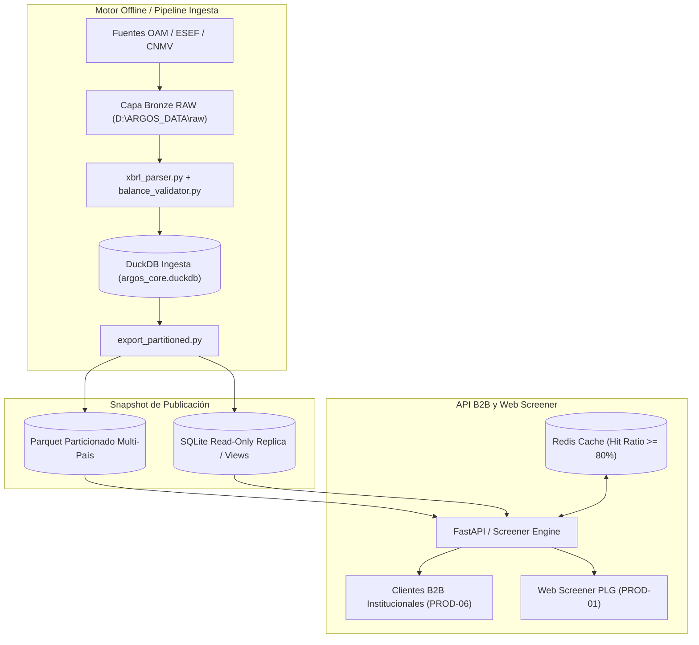

# PLAN MAESTRO ARGOS / STATER — PRODUCCIÓN v2

> Hoja de ruta técnica y de operaciones de producción del repositorio ARGOS hacia la plataforma FinTech de datos financieros institucionales. Este documento establece la gobernanza, separación de almacenamiento, aislamiento de tests y criterios binarios de paso de fase.

---

## 1. Misión y Principios Inviolables

Construir una plataforma de datos financieros y de sostenibilidad institucional basada en:
- **Documentos regulatorios primarios reales** (ESEF, CNMV, SEC EDGAR).
- **Trazabilidad criptográfica total** mediante sellos SHA-256 inmutables.
- **Normalización contable estricta** (XBRL/iXBRL multi-taxonomía).
- **Cuadre contable de tolerancia cero** ($Activo = Pasivo + Patrimonio\ Neto$).
- **Distribución de alta velocidad desacoplada** (API B2B y Screener web).

### Reglas Cardinales:
1. **Solo datos reales en producción**: Queda prohibido generar o aceptar datos financieros sintéticos en el Data Lake de producción. Prohibido ejecutar `clean_and_rebuild_all_institutional.py` para poblar datos reales.
2. **Desacoplamiento total del almacenamiento (`DATA_ROOT`)**: El repositorio Git almacena únicamente código, tests, esquemas y configuraciones. Los datos brutos masivos (paquetes ESEF, ZIPs, PDFs, DuckDB, Parquet) residen en `DATA_ROOT` (por defecto `D:\ARGOS_DATA`). Ninguna ruta a disco estará hardcodeada en el código fuente.
3. **Descubrimiento antes de descarga**: Antes de descargar un solo archivo, el sistema inventaria, valida y certifica lo ya existente en `DATA_ROOT`. Solo se descargan los gaps confirmados.
4. **Contrato de tests dinámico y aislado**: Los tests unitarios no dependen de red ni de archivos masivos externos. Los tests de red y datos reales requieren marcas explícitas (`network`, `real_data`). El baseline no es una cifra estática eterna, sino un registro formal del número de tests verdes correspondiente a cada commit.
5. **Criterios binarios de paso de fase**: Ninguna fase se considera superada por "parecer lista". Se exige evidencia reproducible: test verde, manifiesto sellado con hash, schema validado o recuento de filas Parquet idéntico a la base de datos.

---

## 2. Separación Física de Almacenamiento

| Elemento | Ubicación en Disco | Versionado en Git |
|---|---|:---:|
| Código fuente, parsers y lógica | `REPO_ROOT/ARGOS_MOTOR/` | **SÍ** |
| Tests unitarios y fixtures pequeños | `REPO_ROOT/ARGOS_MOTOR/**/tests/` | **SÍ** |
| Esquemas, taxonomías y configuraciones | `REPO_ROOT/ARGOS_MOTOR/config/` | **SÍ** |
| Manifiestos de control y hashes oficiales | `REPO_ROOT/audits/` | **SÍ** |
| **Datos brutos regulatorios (RAW)** | `DATA_ROOT/raw/{PAIS}_{CANAL}/` | **NO** |
| **Zona de procesamiento STAGING** | `DATA_ROOT/staging/` | **NO** |
| **Data Lake DuckDB (CORE)** | `DATA_ROOT/lake/core/argos_core.duckdb` | **NO** |
| **Data Lake Parquet particionado** | `DATA_ROOT/lake/parquet/{pais}/{ejercicio}/` | **NO** |
| **Snapshots publicados para lectura (API)** | `DATA_ROOT/published/` | **NO** |
| **Informes y logs de auditoría masivos** | `DATA_ROOT/reports/` | Resúmenes sí |

Configuración en entorno:
```bash
ARGOS_DATA_ROOT=D:\ARGOS_DATA
ARGOS_CORE_DB=D:\ARGOS_DATA\lake\core\argos_core.duckdb
```

---

## 3. Arquitectura de Desacoplamiento DuckDB vs. Capa de Servicio

Para resolver de raíz el riesgo **R5** (bloqueo por concurrencia multi-usuario en DuckDB):



**Regla de oro de servicio:**  
El archivo DuckDB de escritura **NUNCA** se expone a peticiones concurrentes de la API pública. La API consume únicamente snapshots Parquet inmutables o réplicas optimizadas de solo lectura respaldadas por Redis.

---

## 4. Política y Aislamiento del Contrato de Tests

Se establece la clasificación estricta de suites en `ARGOS_MOTOR/pyproject.toml`:

```ini
[tool.pytest.ini_options]
testpaths = ["mod_01_ingestion/tests", "mod_02_parser/tests", "mod_03_nlp_audit/tests", "mod_04_data_lake/tests", "mod_05_quant_sfi/tests", "mod_06_api_gateway/tests", "mod_07_ai_agents/tests", "mod_08_monitor/tests"]
addopts = "-v -m 'not network and not external_data'"
markers = [
    "network: pruebas que realizan llamadas HTTP reales hacia entidades externas (ESMA, GLEIF, etc.)",
    "external_data: pruebas que requieren la existencia de archivos en D:\\ARGOS_DATA",
    "real_data: validaciones completas sobre datasets Gold descargados"
]
```

### Comandos de Ejecución de Contrato:
1. **Verificación de Baseline en CI/CD o Turno de Desarrollo (Sin red ni disco externo):**
   ```bash
   python -m pytest -c ARGOS_MOTOR/pyproject.toml ARGOS_MOTOR/ -q
   ```
   *Criterio:* `baseline_tests_passed` registrado en `_baseline_YYYY-MM-DD.json`.
2. **Verificación de Integración con Datos Reales en D:**
   ```bash
   python -m pytest -c ARGOS_MOTOR/pyproject.toml ARGOS_MOTOR/ -q -m "real_data"
   ```

---

## 5. Hoja de Ruta de Fases de Ejecución

```mermaid
gantt
    title Plan Maestro ARGOS v2 — Hoja de Ruta de Producción
    dateFormat  YYYY-MM-DD
    section Fase 0
    Aislamiento de tests y Baseline dual      :done, f0, 2026-09-09, 2026-09-10
    section Fase 1
    Descubrimiento y validación D:\ARGOS_DATA :active, f1, 2026-09-10, 2026-09-12
    Descarga quirúrgica de Gaps ES            :f1_gap, 2026-09-12, 2026-09-14
    section Fase 2
    Parser contextos XBRL y Taxonomía EBITDA/FCF :f2, 2026-09-14, 2026-09-18
    section Fase 3
    Capa Gold España (>= 50 emisores balance OK) :f3, 2026-09-18, 2026-09-22
    section Fase 4
    Publicación Parquet y Réplica Read-Only   :f4, 2026-09-22, 2026-09-25
    section Fase 5
    API B2B Institucional y Control Acceso    :f5, 2026-09-25, 2026-09-29
    section Fase 6
    Web Screener PLG (Next.js)                :f6, 2026-09-29, 2026-10-05
    section Fase 7
    Bridges Multi-País Paralelos (FR, DE, IT, NL) :f7, 2026-09-15, 2026-10-15
    section Fase 8
    Observabilidad, Restatements y Docker/Ops :f8, 2026-10-05, 2026-10-15
```

### Fase 0 — Baseline Dual y Aislamiento de Entorno
- **Objetivo**: Garantizar reproducibilidad total del contrato de tests sin depender de archivos de staging ni red.
- **Entregables**: `_baseline_2026-09-09.json`, `pyproject.toml` blindado con markers.
- **Criterio binario**: Ejecución limpia sin warnings de importación ni caídas de red.

### Fase 1 — Descubrimiento, Reconciliación y Gaps (España)
- **Objetivo**: Validar el inventario real en `D:\ARGOS_DATA\raw\ES_CNMV`.
- **Procedimiento**:
  1. Detectar `DATA_ROOT`.
  2. Verificar `magic bytes` (`PK\x03\x04`) de cada ZIP y recalcular SHA-256.
  3. Cruzar contra `master_universe_es.json` (175 emisores).
  4. Generar `DATA_ROOT_MANIFEST_2022.json` e identificar duplicados y corruptos.
  5. Medir cobertura real verificada (documentar la cifra de 1.060 como hecho oficial reproducido).
  6. Descargar de CNMV/ESMA **únicamente los gaps confirmados**.
- **Criterio binario**: Manifiesto firmado en `audits/` con 100% de hashes y cero archivos corruptos en staging.

### Fase 2 — Extensión del Parser XBRL y Taxonomía Canónica (R7 y R8)
- **Objetivo**: Dotar al parser de capacidad para interpretar contextos complejos, dimensiones y escalas.
- **Acciones**:
  - `xbrl_parser.py`: Soporte de contextos temporales (`instant` vs `duration`), dimensiones de segmento, scaling (`decimals`, factor de escala) y unidades.
  - `taxonomy_dict.yaml`: Mapeo explícito de `ebitda`, `fcf`, `financial_result`, `beneficio_atribuible` y `dividendos_pagados`.
- **Criterio binario**: Tests unitarios de parsing con fixtures reales superados; `test_balance_validator.py` valida $A = P + PN$.

### Fase 3 — Generación de la Capa Gold (España)
- **Objetivo**: Cargar los paquetes validados en `financial_panel`.
- **Criterio binario**:
  - $\ge 50$ emisores españoles con `balance_check=TRUE` verificado.
  - Cobertura documental media $\ge 60\%$.
  - Generación del informe `FORENSIC_AUDIT_ES_{ts}.json`.

### Fase 4 — Publicación Desacoplada de Lectura
- **Objetivo**: Generar los snapshots inmutables para el servicio B2B.
- **Acciones**:
  - Exportar tablas a Parquet particionado: `D:\ARGOS_DATA\lake\parquet\ES\{ejercicio}\`.
  - Crear réplica de lectura SQLite/Parquet para la API.
  - Medir latencia de consulta (< 50 ms en p95).
- **Criterio binario**: Recuento exacto de filas DuckDB == Parquet en todas las particiones.

### Fase 5 — API B2B Institucional (FastAPI)
- **Activación**: Solo tras cumplir el criterio binario de Fase 3 ($\ge 50$ Gold).
- **Criterio binario**: Endpoints operativos validados contra OpenAPI 3.1, autenticación con API Keys hasheadas, rate limiting por tier y tests de error 401/403/429 verdes.

### Fase 6 — Web Screener PLG (Next.js)
- **Activación**: Sobre la capa de lectura publicada (Fase 4 y 5).
- **Criterio binario**: `npm run build` exitoso, Lighthouse score $\ge 90$, cero endpoints expuestos sin autenticación y datos reales servidos.

### Fase 7 — Preparación Multinacional Paralela (FR, DE, IT, NL, US)
- **Estrategia**:
  - Se autoriza el trabajo en paralelo en: conectores OAM, bridges de taxonomía (`taxonomy_bridge_[pais].yaml`), fixtures y esquemas.
  - **Promoción Gold Independiente**: Cada país se declara "en producción" solo cuando cumpla su propio criterio ($\ge 30$ Gold para FR, DE, IT, NL), sin frenar el avance de los demás.
- **Criterio binario**: Manifiesto independiente y pruebas de validación contable por país.

### Fase 8 — Observabilidad, Restatements e Infraestructura Ops
- **Objetivo**: Contenedores Docker, CI/CD, métricas Prometheus y detección de restatements en < 15 minutos.
- **Criterio binario**: `docker compose up` con `/health` 200, alertas de restatement > 5% operativas y backup automático programado.

---

## 6. Jerarquía Documental del Proyecto

```text
Nivel 0: Contratos y Baselines
├── _baseline_YYYY-MM-DD.json
├── CONTRATO_TESTS_Y_ENTORNO.md
└── DECISIONES_ARQUITECTURA.md

Nivel 1: Plan Maestro
└── PLAN_MAESTRO_ARGOS_v2.md (Este documento)

Nivel 2: Especificaciones Técnicas v2
├── SPEC_INGESTA_ES_v2.md
├── SPEC_DATA_LAKE_MULTI_PAIS_v2.md
├── SPEC_API_INSTITUCIONAL_v2.md
├── SPEC_INFRA_OBSERVABILIDAD_v2.md
├── SPEC_WEB_CORPORATIVA_v2.md
└── SPEC_INGESTA_[PAIS]_v2.md

Nivel 3: Gestión de Riesgos y Gobernanza
├── MATRIZ_RIESGOS_v2.md
└── REGISTRO_DECISIONES_Y_EXCEPCIONES.md

Nivel 4: Evidencias e Informes de Ejecución
├── audits/DATA_ROOT_MANIFEST_{ts}.json
├── audits/FORENSIC_AUDIT_ES_{ts}.json
└── audits/REPORT_FASE_{id}_{ts}.md
```
