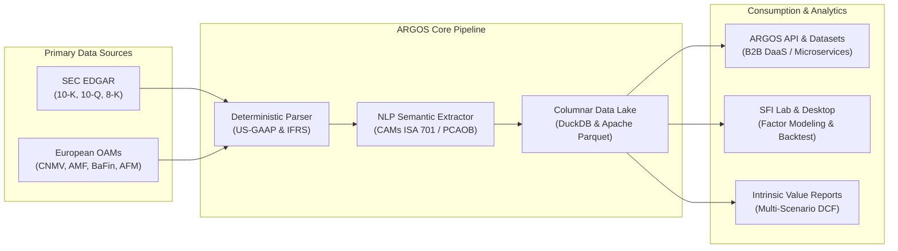

# ARGOS MOTOR — Open Transatlantic Financial Data Infrastructure & Forensic Audit Intelligence

[](https://www.python.org/downloads/)
[](https://duckdb.org/)
[](https://www.sec.gov/edgar)
[](https://github.com/jfulgen94-jpg/Argos-motor)
[](LICENSE)

> **ARGOS MOTOR** is an open, high-performance financial data infrastructure and forensic audit platform that unifies European corporate disclosures (**ESEF/iXBRL**) and US public filings (**SEC EDGAR**) into a normalized, columnar data lake. Powered by deterministic accounting parsers and NLP audit models, ARGOS extracts **Critical Audit Matters (CAMs / KAMs)** and sustainability metrics (**CSRD/ESRS**), democratizing institutional-grade financial analysis.

---

## 🏛️ Key Highlights & Architecture



1. **Transatlantic Filing Unification:** Ingests and standardizes raw XBRL, iXBRL, and XML filings from both the **US Securities and Exchange Commission (SEC)** and **European Officially Appointed Mechanisms (OAMs)**.
2. **Forensic Audit Intelligence (KAMs / CAMs):** Algorithmic extraction of auditor qualification paragraphs, key audit matters (ISA 701), and critical audit matters (PCAOB AS 3101) with automated risk scoring.
3. **CSRD / ESRS Sustainability & Greenwashing Detection:** Structural mapping of environmental and workforce indicators (ESRS S1 vs. SEC Item 101) to identify discrepancies between corporate ESG discourse and regulatory controversy data.
4. **Deterministic Multi-Scenario Modeling:** Valuation models based on discounted cash flow (DCF) with sensitivity matrices (WACC vs. perpetual growth $g$), ensuring reproducibility without subjective investment advice.
5. **Cryptographic Chain of Custody:** Every raw filing and derived dataset is permanently sealed with an immutable **SHA-256 hash**.

---

## ⚡ Quickstart & Usage

### 1. Installation

```bash
git clone https://github.com/jfulgen94-jpg/Argos-motor.git
cd Argos-motor
pip install -r requirements.txt
```

### 2. Python API Example

```python
from stater import StaterEngine, FilingSource

# Initialize the engine
engine = StaterEngine()

# 1. Fetch normalized filing (SEC EDGAR or European ESEF)
filing = engine.fetch_filing(ticker="AAPL", source=FilingSource.SEC_EDGAR, year=2024)

# 2. Extract verified Balance Sheet (Zero-Imbalance Rule: Assets = Liabilities + Equity)
balance_sheet = filing.parse_balance_sheet()
print(f"Total Assets: ${balance_sheet.total_assets:,.2f}")
print(f"Integrity Check: {balance_sheet.is_balanced}")

# 3. Extract Critical Audit Matters (CAMs)
cams = filing.extract_audit_matters()
for cam in cams:
    print(f"• CAM Category: {cam.category} | Severity Score: {cam.severity_score}/100")
    print(f"  Auditor Description: {cam.summary}")

# 4. Export to Columnar Parquet / DuckDB
filing.export_parquet(output_path="./data/aapl_2024_clean.parquet")
```

---

## 🔬 Empirical Research Foundation

STATER is backed by empirical research conducted in collaboration with the **University of Murcia (Master's in Financial Audit)**. The infrastructure validates three core empirical studies across **3,000+ US (NYSE/NASDAQ) and European issuers**:

* **Study 1:** Forensic Audit & Econometric Market Reaction to Critical Audit Matters (PCAOB AS 3101 vs. ISA 701).
* **Study 2:** Quantitative Greenwashing Detection & Social Score (S-Score v2.0) under CSRD and SEC Item 101 disclosures.
* **Study 3:** Quantitative Factor Modeling (Quality, Value, Momentum) and Systematic Portfolio Backtesting in SFI Lab.

---

## 📁 Repository Structure

```text
Argos-motor/
├── ARGOS_MOTOR/         # Transatlantic Financial Data Engine (Ingestion, Parser, NLP, DuckDB, Quant)
├── ARGOS_FIN/           # Financial planning, budgeting, accounting & treasury architecture
├── ARGOS_GOB/           # Strategic governance & corporate manifestos
├── ARGOS_INV/           # Scientific research architecture & empirical audit studies
├── ARGOS_IT/            # IT infrastructure & retail product technical definitions
├── ARGOS_LG/            # Legal, corporate bylaws & SaaS subscription agreements
├── ARGOS_MK/            # Commercial pricing catalog, marketing & retail strategy
├── ARGOS_PROMPTS/       # Technical reports and module prompt engineering
├── Argos_BD/            # Historical datasets (SEC EDGAR & US fundamentals)
├── Argos_SFI_TFM/       # SFI Lab quantitative backtests & CSRD impact outputs
├── LICENSE              # Apache 2.0 Open Source License
└── README.md            # Project overview & documentation
```

---

## 📄 License & Attribution

This project is licensed under the **Apache License 2.0** - see the [LICENSE](LICENSE) file for details.

* **Open Data Attributions:** SEC EDGAR (US Public Domain), European OAMs (Directive (EU) 2019/1024 on Open Data), and GLEIF LEI Codes (Creative Commons CC-BY 4.0).
