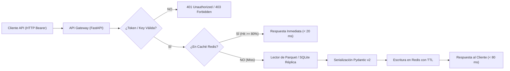

# SPEC — API Institucional B2B v2 (FastAPI Gateway)

## 1. Alcance y Reglas de Activación

La API Institucional B2B (`mod_06_api_gateway`) proporciona acceso programático de baja latencia a los estados contables normalizados, asuntos clave de auditoría (KAM) y modelos de valoración certificados con SHA-256.

### Regla Cardinal de Activación:
> **La API B2B NO se activa en producción ni se expone a clientes externos hasta que la Capa Gold de España alcance $\ge 50$ emisores cuadrados con datos reales verificables.**

---

## 2. Catálogo Oficial de Endpoints y Estados de Madurez

Para eliminar toda ambigüedad entre lo implementado y lo proyectado, cada endpoint se etiqueta con su estado documental estricto:

| Endpoint | Método | Estado Documental | Descripción |
|---|:---:|:---:|---|
| `/health` | `GET` | **EXISTENTE** | Estado del servicio, memoria, conectividad a Redis y versión de datos publicada. |
| `/companies/{lei}/financials` | `GET` | **EXISTENTE — PENDIENTE DE VALIDAR CON DATOS REALES** | Balance, PyG y flujos normalizados por ejercicio. |
| `/companies/{lei}/kams` | `GET` | **EXISTENTE — PENDIENTE DE VALIDAR CON DATOS REALES** | Asuntos clave de auditoría forense extraídos por `mod_03`. |
| `/companies/{lei}/valuation` | `GET` | **EXISTENTE — PENDIENTE DE VALIDAR CON DATOS REALES** | Métricas de descuento de flujos (DCF) y ratios de valoración. |
| `/companies/{lei}/profile` | `GET` | **PROPUESTO** | Datos maestros de identidad (LEI, CIF, sector, segmento, auditores). |
| `/companies/{lei}/esg` | `GET` | **PROPUESTO** | Indicadores clave de sostenibilidad y CSRD. |
| `/screener/filter` | `POST` | **PROPUESTO** | Filtrado multi-variable para el Screener PLG (ratios, país, sector). |
| `/datasets/bulk` | `POST` | **PROPUESTO** | Descarga asíncrona de particiones Parquet completas para Enterprise. |

---

## 3. Arquitectura de Servicio de Lectura y Caché

La API **nunca** abre el archivo `argos_core.duckdb` en modo escritura. La capa de servicio se desacopla mediante:

### Gestión de Caché:
- **Redis TTL**: 24 horas para ejercicios contables cerrados (datos históricos inmutables).
- **Invalidación**: Solo cuando un proceso de publicación en Fase 4 genera una nueva versión o detecta un restatement.
- **Protocolo de Pruebas de Rendimiento**:
  1. *Test Unitario de Caché*: Verificación de mocks y llamadas al cliente Redis.
  2. *Benchmark Reproducible*: Carga local controlada con Locust o wrk (medir latencia p95).
  3. *Prueba de Carga en Staging*: 100 req/s concurrentes sostenidas durante 10 minutos.

---

## 4. Autenticación, Tiers y Rate Limiting

- **Formato de Claves**: Prefijo estándar `stater_live_` o `stater_test_` seguido de 32 bytes criptográficos aleatorios.
- **Seguridad**: Las API keys se almacenan únicamente como hashes SHA-256 en la base de autenticación; nunca en texto plano.
- **Tiers de Consumo**:

| Tier | Peticiones / Minuto | Endpoints Permitidos | Exportación Parquet |
|---|:---:|---|:---:|
| **Free / Community** | 10 req/min | `/health`, `/companies/{lei}/profile`, Screener básico | No |
| **Pro Retail** | 60 req/min | Financieros, ratios, valoración, KAMs | No |
| **Enterprise B2B** | 600 req/min | Catálogo completo + `/datasets/bulk` + Webhooks | **SÍ** |

- **Respuestas de Error Tipificadas**:
  - `401 Unauthorized`: API Key ausente o inválida.
  - `403 Forbidden`: Intento de acceso a un endpoint fuera del scope contratado.
  - `429 Too Many Requests`: Exceso de rate limit (incluye cabecera `Retry-After`).

---

## 5. Criterios Binarios de Aceptación de la API

1. **Contrato OpenAPI**: Especificación OpenAPI 3.1 generada automáticamente y validada sin errores de esquema.
2. **Pruebas de Autenticación Verdes**: 100% de tests unitarios y de integración de auth (`test_api_endpoints.py`) superados.
3. **Validación con Datos Reales**: Al menos 10 empresas del IBEX 35 responden `/companies/{lei}/financials` con datos reales extraídos de `D:\ARGOS_DATA` y `balance_check = true`.
4. **Resistencia a Carga**: Tasa de error $< 0.1\%$ con latencia p95 $< 100\text{ ms}$ en simulación de carga concurrente.
