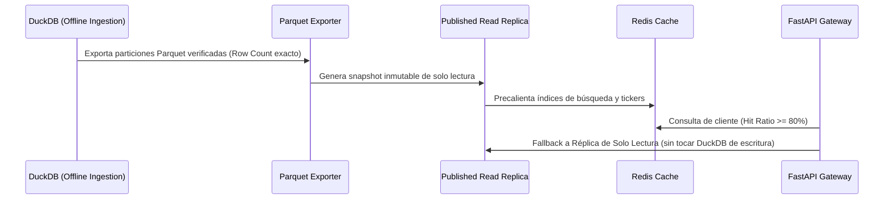

# SPEC — Data Lake Multi-País v2 (DuckDB Ingesta + Parquet Particionado + Publicación Desacoplada)

## 1. Objetivo y Arquitectura de Capas

Evolucionar el Data Lake de ARGOS (`mod_04_data_lake`) hacia una arquitectura desacoplada multi-país de alto rendimiento:
1. **Desacoplamiento total del almacenamiento**: Los datos nunca residen en el repositorio Git.
2. **Desacoplamiento de concurrencia**: La base DuckDB se reserva exclusivamente para ingesta analítica fuera de línea y exportación de Parquet. La API y el Screener público consumen snapshots inmutables en Parquet o réplicas de solo lectura cacheadas en Redis.
3. **Inmutabilidad Append-Only**: Los restatements o correcciones contables nunca sobreescriben datos existentes; generan nuevos registros históricos versionados.

---

## 2. Organización Física del Almacenamiento en `DATA_ROOT`

```text
D:\ARGOS_DATA\ (o variable ARGOS_DATA_ROOT)
├── raw\
│   ├── ES_CNMV\         <- Paquetes ESEF, ZIPs y PDFs de España
│   ├── FR_AMF\          <- Paquetes ESEF de Francia
│   ├── DE_BAFIN\        <- Paquetes ESEF de Alemania
│   ├── IT_CONSOB\       <- Paquetes ESEF de Italia
│   ├── NL_AFM\          <- Paquetes ESEF de Países Bajos
│   └── US_SEC\          <- 10-K, 10-Q de SEC EDGAR
├── staging\             <- Ficheros descomprimidos e índices temporales
├── lake\
│   ├── core\
│   │   └── argos_core.duckdb  <- DuckDB de ingesta analítica offline
│   └── parquet\
│       ├── ES\          <- Parquet particionado por ejercicio
│       ├── FR\
│       ├── DE\
│       ├── IT\
│       └── NL\
├── published\           <- Snapshots de publicación para servicio API / Screener
│   └── read_replica.db  <- Réplica SQLite / DuckDB Read-Only
└── reports\             <- Logs detallados y reportes forenses
```

---

## 3. Modelo de Datos y Migración DDL (Compatibilidad 100%)

Regla de oro: **Ninguna columna existente se elimina ni se renombra**. Se preservan las 5 tablas base:
1. `documents_raw` (Capa Bronze: documentos sellados SHA-256).
2. `financial_facts_raw` (Capa Staging: hechos atómicos XBRL con `is_restated`).
3. `financial_panel` (Capa Core: panel anual consolidado y cuadrado con `balance_check`).
4. `audit_kams` (Capa Core: asuntos clave de auditoría KAM/CAM).
5. `esg_kpis` (Capa Core: métricas de sostenibilidad y CSRD).

### Migración DDL: `mod_04_data_lake/migrations/v002_multicountry.sql`
```sql
-- Añadir columna de país a documents_raw si no existe
ALTER TABLE documents_raw ADD COLUMN IF NOT EXISTS country_code VARCHAR(2);

-- Poblado retroactivo por inferencia de origen
UPDATE documents_raw SET country_code = CASE
    WHEN source = 'CNMV' THEN 'ES'
    WHEN source = 'AMF' THEN 'FR'
    WHEN source = 'BAFIN' THEN 'DE'
    WHEN source = 'CONSOB' THEN 'IT'
    WHEN source = 'AFM' THEN 'NL'
    WHEN source = 'SEC_EDGAR' THEN 'US'
    ELSE 'ES'
END WHERE country_code IS NULL;
```

---

## 4. Política Append-Only para Restatements Contables

Cuando una empresa reformula sus cuentas anuales (restatement):
- **PROHIBIDO** ejecutar `UPDATE` sobre la fila contable original.
- **PROCEDIMIENTO**:
  1. Se inserta un nuevo registro en `financial_facts_raw` con `is_restated = TRUE`.
  2. Se referencia el `fact_id` original y se asigna un nuevo `version_id` o timestamp.
  3. Las consultas por defecto del Screener y la API institucional filtran:
     ```sql
     SELECT * FROM financial_panel WHERE is_restated = FALSE;
     ```
  4. Los módulos de auditoría forense (`mod_03_nlp_audit`) consultan ambas versiones para medir el impacto de la reformulación (si $\Delta > 5\% \rightarrow$ alerta de riesgo contable).

---

## 5. Publicación Desacoplada para la API (Resolución de R5)

DuckDB no soporta escrituras concurrentes mientras múltiples hilos leen intensivamente. El pipeline de publicación desacoplado sigue este ciclo:



- **Comando de exportación**: `lake_manager.export_table_to_parquet('financial_panel', output_path, partition_cols=['country_code', 'fiscal_year'])`.
- **Validación de integridad**: Se verifica programáticamente que:
  $$\text{Row\_Count(DuckDB)} == \text{Row\_Count(Parquet)}$$

---

## 6. Criterios Binarios de Aceptación del Data Lake

1. **Migración Limpia**: `v002_multicountry.sql` ejecutada sobre DuckDB; 100% de nuevas filas con `country_code` no nulo.
2. **Parquet Parity**: Cero diferencias de recuento entre DuckDB y los archivos Parquet particionados.
3. **Prueba de No Bloqueo**: 50 peticiones concurrentes simuladas sobre la réplica de lectura o Parquet sin error de bloqueo de archivo (`DatabaseLockedError`).
4. **Contrato de Tests Inviolable**: La suite `test_lake_integrity.py` pasa en verde sin requerir red.
