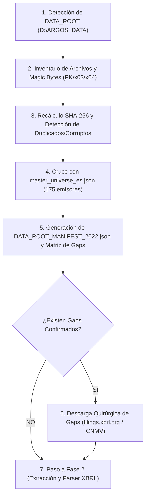

# SPEC — Ingesta España v2 (Descubrimiento D:, Reconciliación y Descarga de Gaps)

## 1. Objetivo y Principios de la Fase

Alcanzar **$\ge 50$ emisores españoles con los 5 documentos regulatorios reales** en la capa Gold del Data Lake:
1. Sello criptográfico SHA-256 inmutable por archivo.
2. Panel financiero cuadrado con tolerancia cero ($Activo = Pasivo + Patrimonio\ Neto$).
3. Cobertura documental media $\ge 60\%$.

### Principio Fundamental: Descubrimiento antes de Descarga
La existencia de datos en almacenamiento externo no se da por supuesta ni se reemplaza ciegamente descargando de nuevo.  
El almacenamiento reportado en `D:\ARGOS_DATA\raw\ES_CNMV` (con una estimación de ~1.060 paquetes de 2022) se cataloga formalmente como:
> `[ESTADO PREVIO REPORTADO: PENDIENTE DE CERTIFICACIÓN Y RECONCILIACIÓN EN REPOSITORIO]`

La descarga batch solo se activará sobre los **gaps estrictamente confirmados** tras el inventario de lo ya existente.

---

## 2. Separación de Rutas y Almacenamiento

| Concepto | Ruta Efectiva | Propósito |
|---|---|---|
| **Raíz de Datos Externos** | `DATA_ROOT` (`D:\ARGOS_DATA`) | Almacén masivo fuera del repositorio Git. |
| **Zona RAW España** | `DATA_ROOT/raw/ES_CNMV/` | Archivos comprimidos originales descargados (ZIP, XHTML, PDF). |
| **Zona STAGING** | `DATA_ROOT/staging/ES/` | Archivos descomprimidos y normalizados para ingesta. |
| **Capa Lake CORE** | `DATA_ROOT/lake/core/argos_core.duckdb` | Base analítica DuckDB. |
| **Manifiestos y Auditorías** | `REPO_ROOT/audits/` | Ficheros JSON de control versionados en Git. |

---

## 3. Pipeline de Descubrimiento, Validación y Descarga de Gaps

El pipeline consta de 6 pasos secuenciales e idempotentes:



### Paso 1: Detección e Inicialización del Entorno
- Comprobar que `D:\ARGOS_DATA\raw\ES_CNMV` es accesible con permisos de lectura/escritura.
- Comprobar espacio en disco disponible ($\ge 20\text{ GB}$).

### Paso 2: Validación Física de Archivos Existentes
- Inspeccionar cada archivo existente.
- Verificar integridad estructural y **magic bytes de cabecera** (`PK\x03\x04` para ZIPs).
- Archivos truncados o vacíos ($0\text{ bytes}$) $\rightarrow$ Mover a `DATA_ROOT/quarantine/`.

### Paso 3: Sellado Criptográfico SHA-256 y Detección de Duplicados
- Recalcular el hash SHA-256 en vuelo para cada archivo físico.
- Detectar colisiones o duplicados exactos por hash y por nombre de paquete.

### Paso 4: Cruce con el Catálogo Maestro de Emisores
- Cruzar cada paquete contra `master_universe_es.json` (175 emisores: IBEX 35, Mercado Continuo, BME Growth).
- Resolver identidad por LEI GLEIF (`resolution_score` $\ge 0.90$) o CIF.
- Si el LEI no resuelve $\rightarrow$ Marcar como `PENDING_REVIEW` en el informe.

### Paso 5: Emisión de Manifiestos de Reconciliación
Generar los siguientes artefactos auditables en `REPO_ROOT/audits/`:
1. `DATA_ROOT_MANIFEST_2022.json`: Inventario de cada archivo con tamaño, hash, LEI, entidad y estado.
2. `ES_COVERAGE_REPORT_2022.json`: Porcentaje de cobertura real contrastado contra el universo de 175 empresas.
3. `ES_GAPS_LIST_2022.json`: Lista de emisores y documentos faltantes para alcanzar el objetivo.

### Paso 6: Descarga Quirúrgica de Gaps
- Solo se invocará el cliente de descarga (`xbrl_org_client.py` / `cnmv_real_downloader.py`) para los elementos listados en `ES_GAPS_LIST_2022.json`.
- Rate limit estricto: 0.3 segundos entre peticiones, backoff exponencial ante 429/403.
- Ventana preferente: fuera de horas pico.

---

## 4. Validación de Contenido: AI Guard y Umbrales de Rama

Para los 5 documentos del paquete institucional (`ESEF_PACKAGE`, `INFORME_GESTION`, `EINF_CSRD`, `IAGC`, `IARC`), se aplican los umbrales de validación real:

| Rama / Documento | Mínimo Caracteres | Mínimo Bytes | Secciones Requeridas |
|---|---|---|---|
| **CCAA_AUDITED (ESEF)** | 10.000 | 12.000 | Balance de situación, PyG, Flujos de efectivo, Memoria, Informe de auditoría. |
| **INFORME_GESTION** | 4.000 | 5.000 | Evolución de negocios, Riesgos e incertidumbres, Liquidez/Crédito, I+D. |
| **EINF_CSRD** | 3.500 | 4.500 | Medioambiente, Dimensión social, Gobernanza, CSRD/ESRS. |
| **IAGC** | 3.000 | 3.500 | Estructura de gobierno, Consejo de administración, Comisiones. |
| **IARC** | 2.500 | 3.000 | Política de remuneraciones, Remuneración del consejo y alta dirección. |

- **Detección Anti-Lorem Ipsum**: Cualquier archivo que contenga patrones sintéticos o de prueba queda bloqueado tajantemente en `QUARANTINE`.

---

## 5. Extracción y Normalización Contable (Fase 2)

Extensión de `xbrl_parser.py` para cumplir con las exigencias del informe contable:
1. **Contextos temporales**: Distinguir hechos de período (`duration`, ej. PyG) de hechos puntuales (`instant`, ej. Balance a 31-12).
2. **Dimensiones de segmento**: Desglosar hechos consolidados frente a segmentos de negocio.
3. **Escala y Decimales**: Aplicar factores de escala (`decimals`, `scale="6"` para millones de euros).
4. **Validación del Balance**: Regla matemática obligatoria:
   $$\text{Total Activo} = \text{Total Pasivo} + \text{Patrimonio Neto}$$
   Si $|Activo - (Pasivo + PN)| > 0.01 \rightarrow \text{balance\_check} = \text{FALSE}$.

---

## 6. Criterios Binarios de Aceptación y Liberación Gold

La Fase de Ingesta y Certificación de España se considerará superada **únicamente** cuando se verifiquen los siguientes criterios de forma reproducible:

1. **Evidencia de Manifiesto**: `DATA_ROOT_MANIFEST_2022.json` generado y alojado en `audits/` con recuento exacto de archivos y hashes.
2. **Cuadre Contable Institucional**:
   ```sql
   SELECT COUNT(DISTINCT entity_lei) 
   FROM financial_panel 
   WHERE source_market = 'ES' 
     AND fiscal_year = 2022 
     AND balance_check = TRUE;
   ```
   **Resultado requerido: $\ge 50$ entidades**.
3. **Cobertura Documental**: Coberura media del universo analizado $\ge 60\%$.
4. **Contrato de Tests Inviolable**: `pytest -c ARGOS_MOTOR/pyproject.toml ARGOS_MOTOR/ -q` finaliza con todos los tests de baseline en verde sin llamadas de red.
